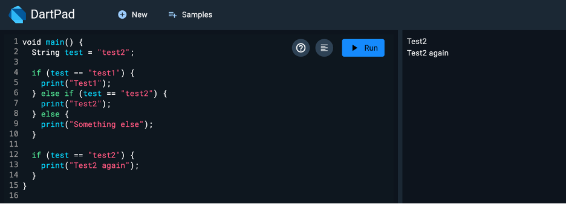
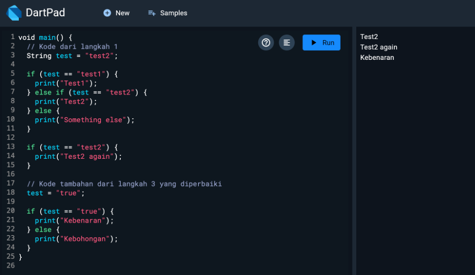
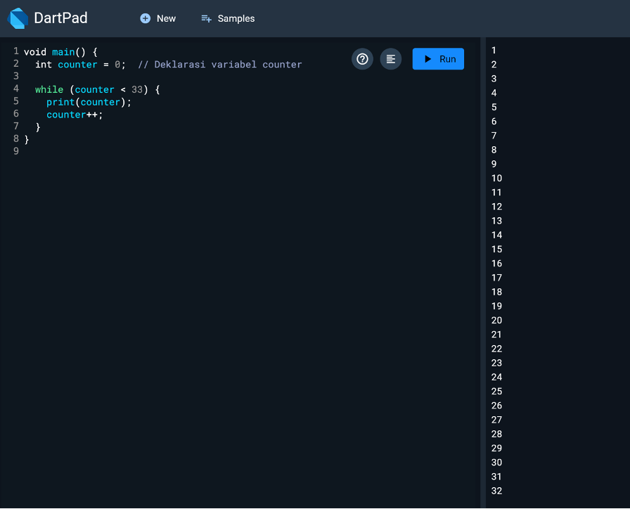
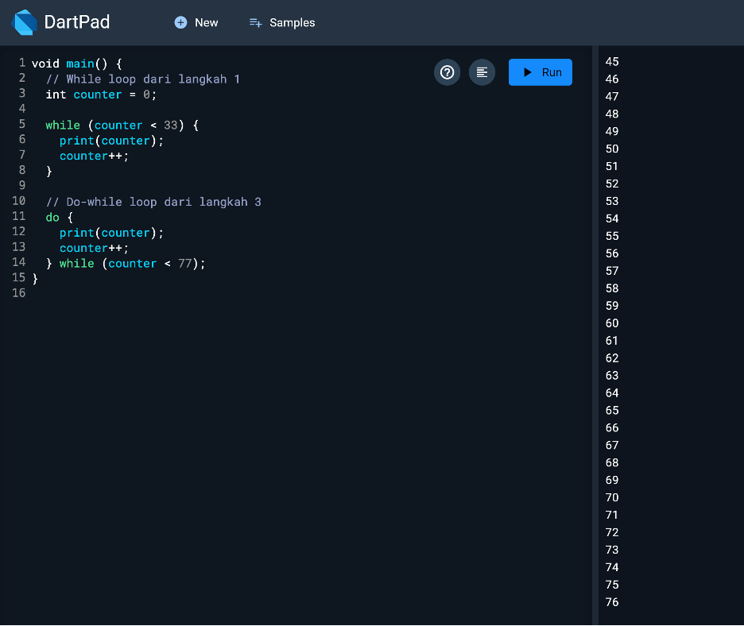
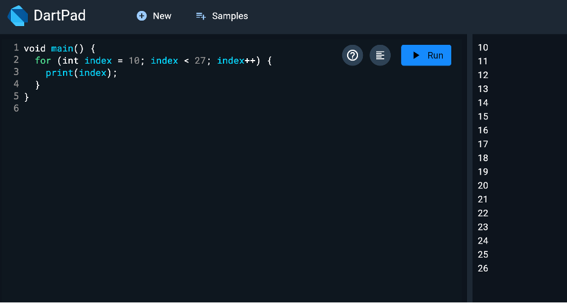
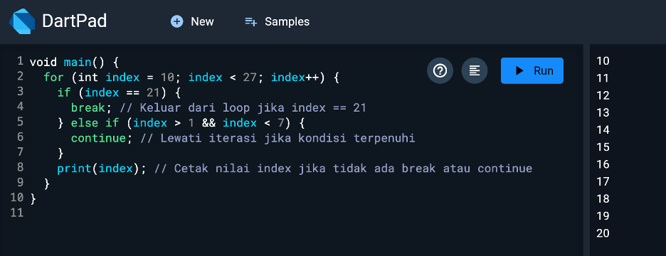
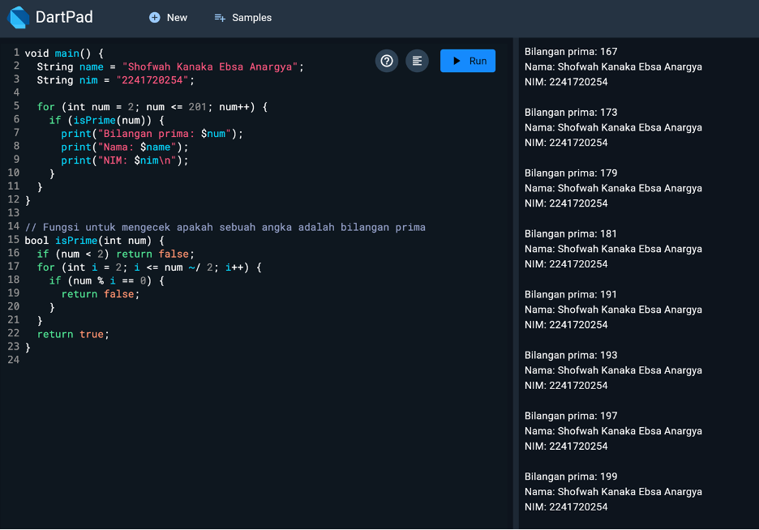

# Tugas Praktikum
## 1.	Silakan selesaikan Praktikum 1 sampai 3, lalu dokumentasikan berupa screenshot hasil pekerjaan beserta penjelasannya!

### Practicum 1 

Jika pada pernyataan if (test == "test2"), nilai dari variabel test adalah "test2", maka kondisi tersebut benar, sehingga program akan mencetak "Test2".
Pada bagian terakhir, kondisi if (test == "test2") juga benar, karena variabel test masih bernilai "test2", sehingga program akan mencetak lagi "Test2 again".

Akan muncul error karena kondisi if (test) tidak bisa menggunakan tipe data String. Dalam pernyataan if, hanya nilai boolean yang valid.
Maka membandingkan variabel test dengan string "true". Jika nilainya sama, program akan mencetak "Kebenaran". Jika berbeda, program akan mencetak "Kebohongan".

### Practicum 2

Kode while memerlukan deklarasi dan inisialisasi variabel counter.

Kode do-while dimulai setelah loop while selesai, dan memastikan bahwa kondisi diperiksa setelah minimal satu kali eksekusi blok di dalam do-while.

### Practicum 3

Kode memerlukan deklarasi variabel index dan penambahan pada loop (index++).

Penggunaan break dan continue berhasil menghentikan atau melanjutkan loop, dan beberapa kesalahan penulisan pada kata kunci (if, else if) perlu diperbaiki.

## 2.	Buatlah sebuah program yang dapat menampilkan bilangan prima dari angka 0 sampai 201 menggunakan Dart. Ketika bilangan prima ditemukan, maka tampilkan nama lengkap dan NIM Anda.

